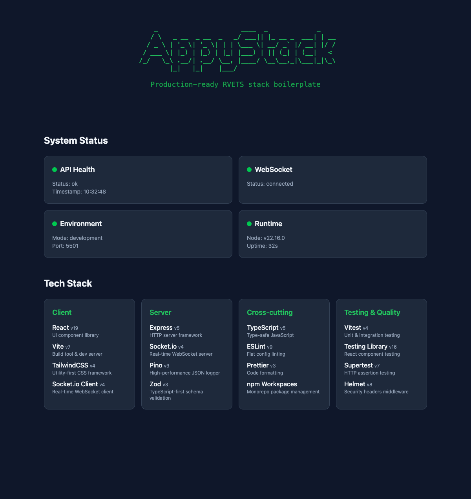

<div align="center">

```
 ██████╗ ██╗   ██╗███████╗████████╗███████╗
 ██╔══██╗██║   ██║██╔════╝╚══██╔══╝██╔════╝
 ██████╔╝╚██╗ ██╔╝█████╗     ██║   ███████╗
 ██╔══██╗ ╚████╔╝ ██╔══╝     ██║   ╚════██║
 ██║  ██║  ╚██╔╝  ███████╗   ██║   ███████║
 ╚═╝  ╚═╝   ╚═╝   ╚══════╝   ╚═╝   ╚══════╝

 AppyStack — React · Vite · Express · TypeScript · Socket.io
```


**Production-ready full-stack monorepo — real-time, type-safe, quality tooling from day one.**

</div>

---



---

## Table of Contents

- [What Is AppyStack?](#what-is-appystack)
- [Prerequisites](#prerequisites)
- [The Architecture](#the-architecture)
- [Quick Start](#quick-start)
- [Getting Started Guide](docs/getting-started.md)
- [Repository Structure](#repository-structure)
- [Recipes](#recipes)
- [Using the Config Package](#using-the-config-package)
- [Proven in Production](#proven-in-production)
- [Philosophy](#philosophy)
- [Contributing](#contributing)
- [License](#license)

---

## What Is AppyStack?

AppyStack is two things in one repository:

| | What | Purpose |
|---|---|---|
| `config/` | Shared ESLint, TypeScript, Vitest & Prettier configs | One source of truth across all your projects |
| `template/` | RVETS monorepo boilerplate | Copy once, start building immediately |

---

## Prerequisites

- **Node.js** 22 or higher
- **npm** 10 or higher (comes with Node 22)

---

## The Architecture

```
client/   React 19 + Vite 7 + TailwindCSS v4     →  :5500
            ↕ dev proxy  (/api  /health  /socket.io)
server/   Express 5 + Socket.io + Pino + Zod      →  :5501
            ↕ imports
shared/   TypeScript interfaces only
```

**Core stack:** React 19 · Vite 7 · Express 5 · TypeScript 5.7+ · Socket.io 4.8

**Quality layer:** Vitest · ESLint 9 flat config · Prettier · Zod · Pino

**Structure:** npm workspaces monorepo — `client` / `server` / `shared`

---

## Quick Start

```bash
# Interactive — prompts for scope, ports, description
npx create-appystack@latest my-app

# One-liner with flags (server port defaults to client port + 1)
npx create-appystack@latest my-app --scope @myorg --port 5500 --description "My app"
```

Then:

```bash
cd my-app
npm run dev
```

> Full setup guide: [docs/getting-started.md](docs/getting-started.md)

### Commands

| Command | What it does |
|---|---|
| `npm run dev` | Start client + server concurrently |
| `npm run build` | Build shared → server → client |
| `npm test` | Run all tests |
| `npm run lint` | ESLint across all workspaces |
| `npm run typecheck` | TypeScript across all workspaces |

---

## Repository Structure

```
appystack/
├── config/                   # @appydave/appystack-config  (npm package)
│   ├── eslint/               #   base.config.js + react.config.js
│   ├── typescript/           #   base.json · react.json · node.json
│   ├── vitest/               #   server.config.ts
│   └── prettier/             #   .prettierrc + .prettierignore
│
├── template/                 # RVETS boilerplate  (copy to start a new app)
│   ├── client/               #   React 19 + Vite 7 + TailwindCSS v4
│   ├── server/               #   Express 5 + Socket.io + Pino
│   ├── shared/               #   TypeScript interfaces only
│   └── .claude/skills/recipe/         #   Claude recipes (see Recipes section)
│       ├── SKILL.md                   #     Recipe index + flow instructions
│       ├── references/                #     16 recipe specs — layout, data, capabilities,
│       │                              #       process (nav-shell, file-crud, entity-socket-crud,
│       │                              #       api-endpoints, add-auth, add-orm, add-state,
│       │                              #       add-sync, add-tanstack-query, wizard-shell,
│       │                              #       csv-bulk-import, local-service, appydave-palette,
│       │                              #       add-elevenlabs-voice, domain-expert-uat, domain-dsl)
│       └── domains/                   #     Pre-built domain definitions
│           ├── care-provider-operations.md
│           └── youtube-launch-optimizer.md
│
└── docs/                     # Architecture decisions + implementation guides
    ├── architecture.md       #   Complete RVETS architecture reference
    ├── requirements.md       #   Setup checklist + verification procedures
    ├── recipes.md            #   Recipe overview + index (see Recipes section)
    ├── review/               #   Research: testing, DX, security, sockets
    └── historical/           #   Post-mortems + implementation guides
```

---

## Recipes

Every project scaffolded by `create-appystack` includes a **recipe system** — a Claude Code skill bundled at `.claude/skills/recipe/` in your new project. Recipes are app architecture patterns that Claude scaffolds into your project: layout, data strategy, API exposure, and layered capabilities. The full catalog (16 recipes) lives in [docs/recipes.md](docs/recipes.md) and [docs/README.md](docs/README.md#recipes-claude-code-skill); a representative slice:

| Category | Recipes |
|----------|---------|
| **Layout** | `nav-shell`, `wizard-shell`, `appydave-palette` |
| **Data** | `file-crud`, `entity-socket-crud`, `add-orm`, `add-sync` |
| **Capabilities** | `add-auth`, `add-state`, `add-tanstack-query`, `api-endpoints`, `local-service`, `csv-bulk-import`, `add-elevenlabs-voice` |
| **Process** | `domain-expert-uat`, `domain-dsl` (format spec) |

Recipes are **composable** — combine `nav-shell` + `file-crud` + `entity-socket-crud` for a complete multi-entity CRUD app, add `api-endpoints` to make it externally accessible.

**How to use:** Open your scaffolded project in Claude Code and ask naturally — no slash command needed. The recipe skill auto-triggers from phrases like:
> *"What recipes are available?"* · *"I want to build a CRUD app"* · *"scaffold a nav-shell app"*

Claude loads the recipe spec, generates a concrete build prompt tailored to your project's actual file structure and entity names, shows you what it will build, and asks for confirmation before making any changes.

> The recipe skill only works inside projects created with `create-appystack` — it ships as part of the scaffold, not from this repo.

**Domain DSLs** — pre-built entity definitions for specific application domains — feed directly into the `file-crud` recipe:

| Domain | Entities |
|--------|----------|
| `care-provider-operations` | Company, Site, User, Participant, Incident, Moment |
| `youtube-launch-optimizer` | Channel, Video, Script, ThumbnailVariant, LaunchTask |

→ Full recipe reference: [docs/recipes.md](docs/recipes.md)

---

## Using the Config Package

```bash
npm install --save-dev @appydave/appystack-config
```

### ESLint

```javascript
// eslint.config.js
import appyConfig from '@appydave/appystack-config/eslint/react';  // or /eslint/base
export default [...appyConfig];
```

### TypeScript

```json
{ "extends": "@appydave/appystack-config/typescript/react" }
```

### Prettier

```json
{ "prettier": "@appydave/appystack-config/prettier" }
```

### Vitest

```typescript
import { mergeConfig } from 'vitest/config';
import appyConfig from '@appydave/appystack-config/vitest/server';
export default mergeConfig(appyConfig, { /* your overrides */ });
```

---

## Proven in Production

AppyStack powers 4 production applications:

| App | Purpose |
|---|---|
| **FliGen** | 12 Days of Claudemas generation harness |
| **FliHub** | Video recording + asset workflows |
| **FliDeck** | Presentation viewer |
| **Storyline App** | Video content planning |

All ship with ✅ automated tests &nbsp;·&nbsp; ✅ CI/CD &nbsp;·&nbsp; ✅ type-safe config &nbsp;·&nbsp; ✅ structured logging

---

## Philosophy

> **Start production-ready. Don't bolt on quality later.**

- **Consistency** — same architecture, same patterns across every project
- **Type safety** — shared interfaces flow from server to client via `shared/`
- **Real-time built in** — Socket.io wired and working from the first commit
- **Quality enforced** — linting, formatting, and tests are non-negotiable defaults

---

## Contributing

Contributions are welcome. Please open an issue first to discuss what you'd like to change.

1. Fork the repo
2. Create a feature branch (`git checkout -b feat/my-feature`)
3. Commit your changes
4. Open a pull request

---

## License

MIT © [AppyDave](https://github.com/appydave)

---

*Part of the [AppyDave](https://github.com/appydave) ecosystem*
